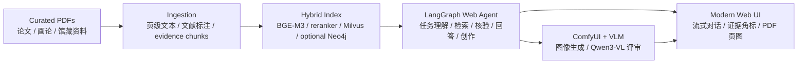
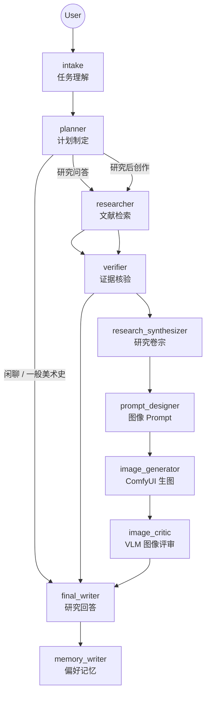
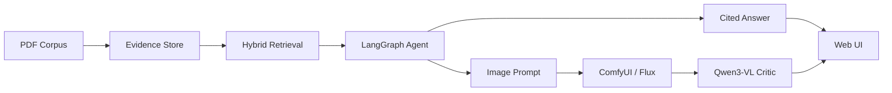

# ShanshuiAgent | 山水智研

<p>
  <a href="#中文"><strong>中文</strong></a>
  ·
  <a href="#english"><strong>English</strong></a>
</p>

<p>
  
  
  
  
  
</p>

## 中文

ShanshuiAgent（山水智研）是一个面向**中国山水画研究与创作**的证据型 Agent 系统。它把 PDF 文献、向量检索、证据核验、LangGraph 编排、流式 Web UI、ComfyUI 图像生成和 VLM 图像评审串成一个完整工作流：先查证据，再回答或创作。

它不是一个普通聊天机器人，而是一个围绕“中国山水画史、画论、技法、流派、作品和文献证据”的研究工作台。

仓库地址：https://github.com/zekai00/ShanshuiAgent

### 适合谁

| 使用者 | 可以用它做什么 |
|---|---|
| 中国美术史研究者 | 基于 PDF 文献检索证据、查看原始页图、生成带来源的回答 |
| 数字人文开发者 | 参考 PDF 到 RAG evidence store 的构建链路 |
| Agent 工程实践者 | 查看 LangGraph 如何编排路由、检索、核验、回答、创作和记忆 |
| AI 图像创作者 | 用文献约束生成山水画 prompt，并调用 ComfyUI 生成图像 |
| 评测/训练研究者 | 使用检索、回答、错误前提和路由校准脚本构建闭环 |

### 系统一览



### 核心能力

| 模块 | 作用 | 主要技术 |
|---|---|---|
| 文献入库 | 从 PDF 建立文献级、页级和 chunk 级证据链 | PyMuPDF, metadata JSONL |
| 混合检索 | 根据问题召回、重排并返回可追溯证据 | BGE-M3, reranker, Milvus |
| 图谱增强 | 可选地补充人物、朝代、流派、技法关系 | Neo4j |
| Agent 编排 | 将任务理解、计划、检索、核验、回答和创作拆成可追踪节点 | LangGraph |
| 研究回答 | 基于证据生成回答，并保留可点击来源 | DeepSeek-compatible API |
| 图像创作 | 先从文献提炼约束，再生成 ComfyUI/Flux prompt | ComfyUI, Flux workflow |
| 图像评审 | 检查生成图像是否符合山水画和研究约束 | Qwen3-VL |
| 评测训练 | 跑检索、回答、路由、错误前提和 SFT 数据构建 | eval scripts, training scripts |

### Agent 工作流



### Web UI

当前 Web UI 支持：

| 界面能力 | 说明 |
|---|---|
| 流式回答 | 回答边生成边显示 |
| 引用角标 | 正文中的 `[1]`、`[2]` 会变成可点击引用 |
| PDF 页图 | 点击引用可直接查看对应 PDF 页面的图片 |
| 证据抽屉 | 小屏或专注回答时可收起证据栏 |
| 语料筛选 | 按朝代、流派、技法、权威等级筛选文献 |
| Agent trace | 显示当前任务经过了哪些 LangGraph 节点 |
| 图像任务 | 支持“先检索研究，再生成山水画”的创作流程 |

### 项目结构

```text
src/
  web_agent/      LangGraph Web Agent 节点、状态、事件流
  retrieval/      在线检索、BGE-M3、reranker、Milvus、Neo4j 集成
  ingestion/      PDF 文本抽取、文献处理、入库链路
  agent/          旧版/实验性 Agent 代码，当前 Web 主链路不依赖它
scripts/
  retrieval/      evidence store 和 Milvus 构建脚本
  eval/           检索、回答、路由校准评测脚本
  training/       researcher SFT 数据构建脚本
  datasets/       权威文献整理、迁入、命名、分类脚本
ui/modern/        当前 Web 工作台
workflows/        ComfyUI workflow
docs/             设计、评测、训练和重构报告
data/eval/        小型路由校准评测数据
```

### 快速启动

> 这个仓库不内置大模型权重、API key 或完整 PDF 语料库。运行前需要准备 `.env`、本地模型路径和自己的文献数据。

```bash
pip install -r requirements.txt
cp .env.example .env
python scripts/run_web_app.py --host 127.0.0.1 --port 7861
```

打开：

```text
http://127.0.0.1:7861
```

### 关键配置

| 配置项 | 作用 |
|---|---|
| `DEEPSEEK_API_KEY` | 研究回答、路由、研究卷宗和 prompt 设计默认使用的在线 LLM |
| `CL_BGE_M3_PATH` | BGE-M3 检索编码器路径 |
| `CL_RERANKER_PATH` | reranker 模型路径 |
| `CL_RETRIEVAL_EVIDENCE_DIR` | evidence store 目录 |
| `CL_RETRIEVAL_MILVUS_DB_PATH` | Milvus Lite 数据库路径 |
| `NEO4J_URI` / `NEO4J_PASSWORD` | 可选 Neo4j 图谱检索 |
| `CL_COMFYUI_SERVER_URL` | 可选 ComfyUI 服务地址 |
| `CL_VLM_CRITIC_MODEL_PATH` | 可选 Qwen3-VL 图像评审模型路径 |

### 构建证据索引

如果你已经准备好 PDF 文献和模型路径，可以按下面顺序构建 evidence store 和 Milvus 索引：

```bash
python scripts/retrieval/build_authority_evidence_store.py
python scripts/retrieval/build_milvus_from_evidence_store.py
python scripts/retrieval/smoke_test_retrieval.py
```

### 评测与训练

```bash
python scripts/eval/run_retrieval_baseline.py
python scripts/eval/run_researcher_answer_baseline.py
python scripts/eval/run_router_threshold_calibration.py
python scripts/training/build_researcher_sft_dataset.py
```

训练策略建议：

| 阶段 | 优先级 | 说明 |
|---|---:|---|
| 扩充和清洗评测集 | 高 | 先确认系统到底错在哪里 |
| 稳定 RAG 证据链路 | 高 | 检索、来源、页码、chunk 结构必须可靠 |
| SFT | 中 | 用于学习项目回答格式和证据意识 |
| DPO/GRPO/PPO | 低 | 只有在已有稳定偏好数据后再考虑 |

### 当前限制

- 这是研究原型，不是开箱即用的云服务。
- 完整 PDF 语料、Milvus 索引、本地模型和 ComfyUI 权重需要自行准备。
- Web UI 默认依赖 DeepSeek-compatible API；如果没有 API key，会降级为证据摘要或规则回答。
- 图像生成依赖独立 ComfyUI 服务；服务不可用时，Agent 仍会输出研究卷宗和 prompt，但不会生成图片。

### 推荐阅读

- [项目总览](docs/项目总览.md)
- [LangGraph 版 WebAgent 节点流转与模型 Prompt 说明](docs/20260601-1500-LangGraph版WebAgent节点流转与模型Prompt说明.md)
- [RAG 证据链路重构报告](docs/20260530-1414-RAG证据链路重构报告.md)

## English

ShanshuiAgent is an evidence-grounded agent system for Chinese landscape painting research and generation. It connects PDF-based literature ingestion, hybrid retrieval, source verification, LangGraph orchestration, a streaming Web UI, ComfyUI image generation, and VLM-based image critique.

Repository: https://github.com/zekai00/ShanshuiAgent

### What It Does

| Area | Description |
|---|---|
| Evidence-grounded QA | Answers Chinese landscape painting questions with traceable citations |
| PDF provenance | Preserves document, page, chunk, and original PDF references |
| Hybrid retrieval | Uses BGE-M3, a reranker, Milvus, and optional Neo4j |
| Agent orchestration | Uses LangGraph for task routing, retrieval, verification, answer writing, and image workflows |
| Web workspace | Streams answers and opens cited PDF page previews |
| Image creation | Turns retrieved research constraints into ComfyUI prompts |
| Visual critique | Uses local Qwen3-VL to review generated images against research constraints |

### Architecture



### Quick Start

```bash
pip install -r requirements.txt
cp .env.example .env
python scripts/run_web_app.py --host 127.0.0.1 --port 7861
```

Then open:

```text
http://127.0.0.1:7861
```

You need to configure your own API keys, local model paths, evidence store, and optional ComfyUI/Neo4j services. This repository does not ship large model weights or a complete production corpus.

### Rebuild Retrieval Indexes

```bash
python scripts/retrieval/build_authority_evidence_store.py
python scripts/retrieval/build_milvus_from_evidence_store.py
python scripts/retrieval/smoke_test_retrieval.py
```

### Evaluation

```bash
python scripts/eval/run_retrieval_baseline.py
python scripts/eval/run_researcher_answer_baseline.py
python scripts/eval/run_router_threshold_calibration.py
```

### Repository Map

| Path | Purpose |
|---|---|
| `src/web_agent/` | LangGraph Web Agent implementation |
| `src/retrieval/` | Hybrid retrieval and online retrieval logic |
| `src/ingestion/` | PDF processing and ingestion |
| `scripts/retrieval/` | Evidence store and Milvus build scripts |
| `scripts/eval/` | Evaluation scripts |
| `ui/modern/` | Current Web interface |
| `workflows/` | ComfyUI workflow files |
| `docs/` | Project reports and design notes |

### Status

ShanshuiAgent is currently a research prototype. The strongest parts of the project are the evidence chain, retrieval workflow, LangGraph orchestration, and UI-level citation experience. Deployment packaging, corpus distribution, and reproducible model downloads are still future work.
