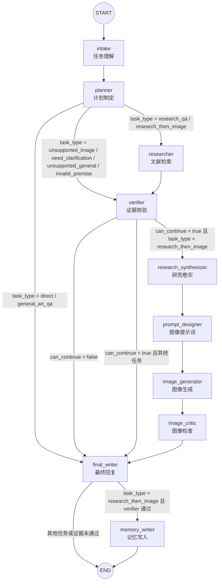
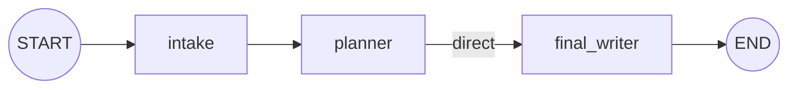
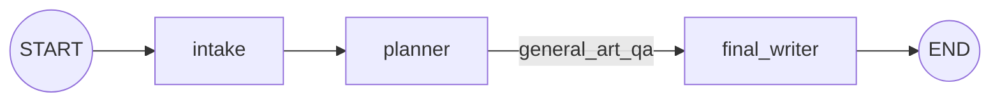
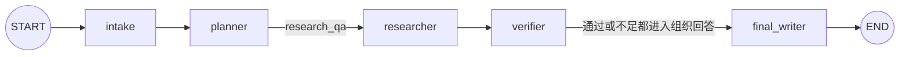
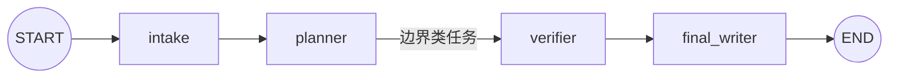

# LangGraph 节点与条件边流转图

生成时间：2026-06-01 14:50 CST

## 1. 当前前端主链路：LangGraph Web Agent

这张图对应当前 `http://127.0.0.1:7861/` 前端实际调用的 `/api/agent/stream` 主链路。

代码位置：

- 图定义：`src/web_agent/graph.py:38-86`
- 条件边函数：`src/web_agent/nodes.py:280-304`
- Web 入口：`scripts/run_web_app.py:1453-1467`



## 2. 条件边展开表

### 2.1 `planner` 后的条件边

代码位置：`src/web_agent/nodes.py:280-286`

| 条件 | 下一个节点 | 对应任务 |
|---|---|---|
| `task_type in {"direct", "general_art_qa"}` | `final_writer` | 闲聊、一般中国绘画史事实问答 |
| `task_type in {"unsupported_image", "need_clarification", "unsupported_general", "invalid_premise"}` | `verifier` | 图像边界、需要澄清、无关问题、错误前提 |
| 其他情况 | `researcher` | `research_qa`、`research_then_image` |

### 2.2 `verifier` 后的条件边

代码位置：`src/web_agent/nodes.py:289-296`

| 条件 | 下一个节点 | 含义 |
|---|---|---|
| `can_continue = false` | `final_writer` | 证据不足或前提不能支撑，直接组织拒答/说明 |
| `can_continue = true` 且 `task_type == "research_then_image"` | `research_synthesizer` | 证据可用，进入研究卷宗和生图链路 |
| 其他情况 | `final_writer` | 研究问答或边界类任务进入最终回复 |

### 2.3 `final_writer` 后的条件边

代码位置：`src/web_agent/nodes.py:299-304`

| 条件 | 下一个节点 | 含义 |
|---|---|---|
| `task_type == "research_then_image"` 且 `verifier can_continue = true` | `memory_writer` | 生图任务交付后记录明确偏好 |
| 其他情况 | `END` | 本轮结束 |

## 3. 任务类型对应路径

### 3.1 `direct`



### 3.2 `general_art_qa`



### 3.3 `research_qa`



### 3.4 `research_then_image`

```mermaid
flowchart LR
    START((START)) --> intake["intake"]
    intake --> planner["planner"]
    planner -->|research_then_image| researcher["researcher"]
    researcher --> verifier["verifier"]
    verifier -->|通过| research_synthesizer["research_synthesizer"]
    verifier -->|不通过| final_writer["final_writer"]
    research_synthesizer --> prompt_designer["prompt_designer"]
    prompt_designer --> image_generator["image_generator"]
    image_generator --> image_critic["image_critic"]
    image_critic --> final_writer
    final_writer -->|通过且为生图任务| memory_writer["memory_writer"]
    final_writer -->|不通过| END((END))
    memory_writer --> END
```



### 3.5 边界类任务

适用于：

- `unsupported_image`
- `need_clarification`
- `unsupported_general`
- `invalid_premise`



## 4. 旧版 LangGraph 图

旧版图仍然保留，没有被覆盖。它不是当前前端主链路。

代码位置：

- 图定义：`src/agent/graph.py:14-93`
- 节点注册：`src/agent/graph.py:18-23`
- 条件边：`src/agent/graph.py:32-70`
- worker 边：`src/agent/graph.py:81-83`

```mermaid
flowchart TD
    START((START))
    END((END))

    gateway["gateway<br/>网关"]
    summarizer["summarizer<br/>滚动摘要"]
    supervisor["supervisor<br/>主管路由"]
    researcher["researcher<br/>研究员"]
    artist["artist<br/>画师"]
    chatter["chatter<br/>闲聊"]

    START --> gateway
    gateway -->|len(messages) > 10| summarizer
    gateway -->|len(messages) <= 10| supervisor
    summarizer --> supervisor
    supervisor -->|next_node = researcher| researcher
    supervisor -->|next_node = artist| artist
    supervisor -->|next_node = chatter| chatter
    supervisor -->|next_node = finish| END
    researcher --> gateway
    artist --> END
    chatter --> END
```

## 5. 一句话总结

当前真正服务前端的是第 1 张图：`src/web_agent/graph.py` 中的新 LangGraph Web Agent。旧版 `src/agent/graph.py` 只是保留的旧命令行/实验链路。
