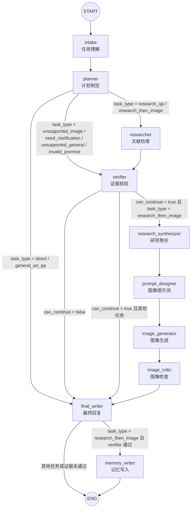
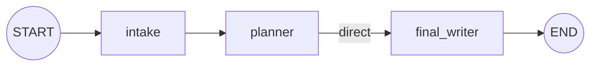
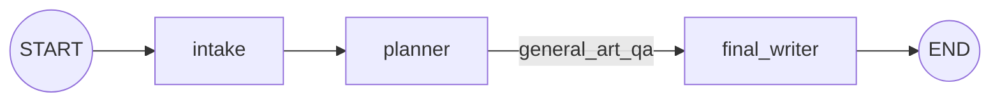
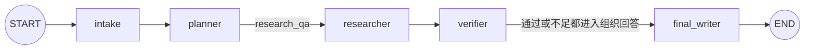
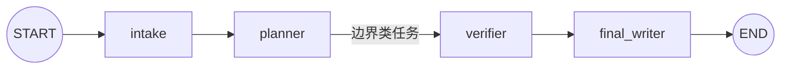

# LangGraph 版 WebAgent 节点流转与模型 Prompt 说明

首次生成时间：2026-06-01 14:50 CST
本次补充时间：2026-06-01 15:00 CST

## 1. 当前前端主链路：LangGraph Web Agent

这张图对应当前 `http://127.0.0.1:7861/` 前端实际调用的 `/api/agent/stream` 主链路。

代码位置：

- 图定义：`src/web_agent/graph.py:38-86`
- 条件边函数：`src/web_agent/nodes.py:280-304`
- Web 入口：`scripts/run_web_app.py:1453-1467`



## 2. 条件边展开表

### 2.1 `planner` 后的条件边

代码位置：`src/web_agent/nodes.py:280-286`

| 条件 | 下一个节点 | 对应任务 |
|---|---|---|
| `task_type in {"direct", "general_art_qa"}` | `final_writer` | 闲聊、一般中国绘画史事实问答 |
| `task_type in {"unsupported_image", "need_clarification", "unsupported_general", "invalid_premise"}` | `verifier` | 图像边界、需要澄清、无关问题、错误前提 |
| 其他情况 | `researcher` | `research_qa`、`research_then_image` |

### 2.2 `verifier` 后的条件边

代码位置：`src/web_agent/nodes.py:289-296`

| 条件 | 下一个节点 | 含义 |
|---|---|---|
| `can_continue = false` | `final_writer` | 证据不足或前提不能支撑，直接组织拒答/说明 |
| `can_continue = true` 且 `task_type == "research_then_image"` | `research_synthesizer` | 证据可用，进入研究卷宗和生图链路 |
| 其他情况 | `final_writer` | 研究问答或边界类任务进入最终回复 |

### 2.3 `final_writer` 后的条件边

代码位置：`src/web_agent/nodes.py:299-304`

| 条件 | 下一个节点 | 含义 |
|---|---|---|
| `task_type == "research_then_image"` 且 `verifier can_continue = true` | `memory_writer` | 生图任务交付后记录明确偏好 |
| 其他情况 | `END` | 本轮结束 |

## 3. 任务类型对应路径

### 3.1 `direct`



### 3.2 `general_art_qa`



### 3.3 `research_qa`



### 3.4 `research_then_image`

```mermaid
flowchart LR
    START((START)) --> intake["intake"]
    intake --> planner["planner"]
    planner -->|research_then_image| researcher["researcher"]
    researcher --> verifier["verifier"]
    verifier -->|通过| research_synthesizer["research_synthesizer"]
    verifier -->|不通过| final_writer["final_writer"]
    research_synthesizer --> prompt_designer["prompt_designer"]
    prompt_designer --> image_generator["image_generator"]
    image_generator --> image_critic["image_critic"]
    image_critic --> final_writer
    final_writer -->|通过且为生图任务| memory_writer["memory_writer"]
    final_writer -->|不通过| END((END))
    memory_writer --> END
```



### 3.5 边界类任务

适用于：

- `unsupported_image`
- `need_clarification`
- `unsupported_general`
- `invalid_premise`



## 4. 旧版 LangGraph 图

旧版图仍然保留，没有被覆盖。它不是当前前端主链路。

代码位置：

- 图定义：`src/agent/graph.py:14-93`
- 节点注册：`src/agent/graph.py:18-23`
- 条件边：`src/agent/graph.py:32-70`
- worker 边：`src/agent/graph.py:81-83`

```mermaid
flowchart TD
    START((START))
    END((END))

    gateway["gateway<br/>网关"]
    summarizer["summarizer<br/>滚动摘要"]
    supervisor["supervisor<br/>主管路由"]
    researcher["researcher<br/>研究员"]
    artist["artist<br/>画师"]
    chatter["chatter<br/>闲聊"]

    START --> gateway
    gateway -->|len(messages) > 10| summarizer
    gateway -->|len(messages) <= 10| supervisor
    summarizer --> supervisor
    supervisor -->|next_node = researcher| researcher
    supervisor -->|next_node = artist| artist
    supervisor -->|next_node = chatter| chatter
    supervisor -->|next_node = finish| END
    researcher --> gateway
    artist --> END
    chatter --> END
```

## 5. 当前模型配置

补充时间：2026-06-01 15:00 CST

当前运行时读取到的核心模型配置：

| 项 | 当前值 | 代码位置 |
|---|---|---|
| 回答/卷宗/Prompt 设计默认 LLM | `deepseek-v4-flash` | `src/config.py:138-140` |
| 路由 LLM | `deepseek-v4-flash`，默认等于 `FAST_LLM_MODEL` | `scripts/run_web_app.py:48` |
| LLM API Base URL | `https://api.deepseek.com/v1` | `src/config.py:138-140` |
| Agent 语义路由开关 | `CL_AGENT_LLM_ROUTER_ENABLED`，默认开启 | `scripts/run_web_app.py:50` |
| 检索 Query 编码器 | BGE-M3，当前路径 `/root/models/bge-m3` | `src/config.py:110-112`、`src/retrieval/online_retrieval.py:101-104` |
| 检索 reranker | BGE reranker，当前路径 `/root/models/bge-reranker-v2-m3` | `src/config.py:110-112`、`src/retrieval/online_retrieval.py:105-106` |
| 图像生成引擎 | ComfyUI workflow，UNET 为 `flux1-krea-dev.safetensors` | `scripts/run_web_app.py:766-834`、`workflows/flux1_krea_dev-api.json:64-70` |

需要注意：当前 Web LangGraph 节点通过依赖注入调用能力。依赖契约在 `src/web_agent/dependencies.py:15-36`，实际注入发生在 `scripts/run_web_app.py:1269-1292`。所以“节点是否挂大模型”要看节点调用的依赖函数内部是否调用 LLM。

## 6. 每个节点的大模型与 Prompt 说明

### 6.1 总览表

| LangGraph 节点 | 是否挂大语言模型 | 当前大模型/非 LLM 模型 | 是否有自己的 Prompt | 实现位置 |
|---|---:|---|---|---|
| `intake` | 有，条件启用 | `ROUTER_LLM_MODEL = deepseek-v4-flash`；规则兜底 | 有，内联 system/user prompt | `src/web_agent/nodes.py:17-28`、`scripts/run_web_app.py:443-522` |
| `planner` | 没有 | 纯规则 | 没有 | `src/web_agent/nodes.py:31-40`、`scripts/run_web_app.py:606-627` |
| `researcher` | 没有回答 LLM | BGE-M3、BGE reranker、Milvus、ColBERT、Neo4j、spaCy | 没有自然语言 Prompt | `src/web_agent/nodes.py:43-55`、`src/retrieval/online_retrieval.py:93-143` |
| `verifier` | 没有 | 纯规则 | 没有 | `src/web_agent/nodes.py:58-105` |
| `research_synthesizer` | 有，条件启用 | `FAST_LLM_MODEL = deepseek-v4-flash`；规则兜底 | 有，内联 system/user prompt | `src/web_agent/nodes.py:108-120`、`scripts/run_web_app.py:659-694` |
| `prompt_designer` | 有，条件启用 | `FAST_LLM_MODEL = deepseek-v4-flash`；规则兜底 | 有，内联 system/user prompt | `src/web_agent/nodes.py:123-139`、`scripts/run_web_app.py:723-757` |
| `image_generator` | 不挂大语言模型 | ComfyUI + Flux workflow，UNET `flux1-krea-dev.safetensors` | 不生成 Prompt，只消费 `image_spec.positive_prompt` | `src/web_agent/nodes.py:142-153`、`scripts/run_web_app.py:766-834` |
| `image_critic` | 没有 | 文件检查 + prompt 关键词规则 | 没有 | `src/web_agent/nodes.py:156-168`、`scripts/run_web_app.py:837-852` |
| `final_writer` | 部分路径有 | `FAST_LLM_MODEL = deepseek-v4-flash` 用于 `research_qa` 和部分 `general_art_qa` | 有，按任务路径不同 | `src/web_agent/nodes.py:171-262`、`scripts/run_web_app.py:967-1100` |
| `memory_writer` | 没有 | 正则抽取 + SQLite MemoryManager | 没有 | `src/web_agent/nodes.py:265-277`、`scripts/run_web_app.py:900-922` |

### 6.2 `intake`：任务理解

是否挂大模型：**有，条件启用**。

节点本身调用：

- `deps.build_agent_intake(question, history)`：`src/web_agent/nodes.py:17-26`
- 依赖注入：`scripts/run_web_app.py:1274-1276`

实际 LLM 调用：

- 函数：`classify_agent_intake_with_llm()`，代码位置 `scripts/run_web_app.py:443-522`
- 开关：`AGENT_LLM_ROUTER_ENABLED` 和 `DEEPSEEK_API_KEY`，代码位置 `scripts/run_web_app.py:443-445`
- 模型：`ROUTER_LLM_MODEL`，当前为 `deepseek-v4-flash`，代码位置 `scripts/run_web_app.py:48`、`scripts/run_web_app.py:482-486`
- temperature：`0`
- max_tokens：`260`

Prompt：**有，内联 prompt**。

system prompt 目的：

- 充当“山水画研究创作智能体的任务理解器”。
- 只输出 JSON。
- 结合最近对话理解省略和指代，比如“能画一幅类似的吗”。
- 限定 `task_type` 只能从固定集合中选择。
- 区分 `research_qa`、`research_then_image`、`general_art_qa`、`direct`、`unsupported_general`、`invalid_premise` 等类型。
- 要求输出 `entities`、`needs_retrieval`、`needs_image`、`confidence`。

代码位置：`scripts/run_web_app.py:451-480`

user prompt 内容：

- 最近对话：`compact_history(history)`
- 当前用户问题
- JSON 输出格式约束

代码位置：`scripts/run_web_app.py:469-480`

规则兜底：

- `build_rule_agent_intake()`：`scripts/run_web_app.py:527-566`
- 硬拦截错误前提：`scripts/run_web_app.py:569-579`
- 上下文续问图像创作保护：`scripts/run_web_app.py:580-589`
- LLM 置信度不足时回退规则：`scripts/run_web_app.py:596-603`

结论：`intake` 是当前最重要的 LLM 路由节点，但不是完全依赖 LLM。现代技术错置这类硬错误会优先走规则。

### 6.3 `planner`：计划制定

是否挂大模型：**没有**。

节点调用：

- `deps.build_agent_plan(intake)`：`src/web_agent/nodes.py:31-38`
- 依赖注入：`scripts/run_web_app.py:1274-1277`

实际逻辑：

- `direct` / `general_art_qa` → 只计划 `final_writer`
- 边界类任务 → `verifier` + `final_writer`
- `research_qa` → `researcher` + `verifier` + `final_writer`
- `research_then_image` → 检索、核验、卷宗、Prompt、生图、检查、最终回复、记忆写入

代码位置：`scripts/run_web_app.py:606-627`

Prompt：**没有**。这是纯规则节点。

### 6.4 `researcher`：文献检索

是否挂大语言模型：**没有**。

它不是回答模型节点，而是检索节点。它调用：

- `get_retriever(top_k, final_k)`：`src/web_agent/nodes.py:43-49`
- `retrieve_and_rerank(question)`：`src/web_agent/nodes.py:49`
- `evidence_payload()` 把检索结果整理成前端证据结构：`src/web_agent/nodes.py:50`

非 LLM 模型和系统：

- BGE-M3 Query 编码器：`src/retrieval/online_retrieval.py:101-104`
- BGE reranker：`src/retrieval/online_retrieval.py:105-106`
- Milvus Lite：`src/retrieval/online_retrieval.py:108-111`
- canonical evidence store：`src/retrieval/online_retrieval.py:145-180`
- ColBERT 细粒度张量：`src/retrieval/online_retrieval.py:119-124`
- Neo4j 知识图谱：`src/retrieval/online_retrieval.py:126-137`
- spaCy 实体识别：`src/retrieval/online_retrieval.py:139`

Prompt：**没有自然语言 Prompt**。

这里的“输入”是用户问题字符串；检索器把它编码为向量、做多路检索、融合、重排，然后返回 evidence chunk。

### 6.5 `verifier`：证据核验

是否挂大模型：**没有**。

实现位置：`src/web_agent/nodes.py:58-105`

规则逻辑：

- `unsupported_image`：标为边界问题，但允许进入 `final_writer` 给边界说明。
- `need_clarification` / `unsupported_general`：标为需要澄清或不属于范围。
- `invalid_premise`：直接使用 `intake.premise_issue` 的错误前提说明。
- 如果是“需要证据的前提风险”且证据不相关：`can_continue = false`。
- 如果需要检索但证据相关性不足：`can_continue = false`。
- 其他情况：`can_continue = true`。

Prompt：**没有**。这是规则判断节点。

### 6.6 `research_synthesizer`：研究卷宗

是否挂大模型：**有，条件启用**。

节点调用：

- `deps.synthesize_research_brief(question, evidence, intake)`：`src/web_agent/nodes.py:108-118`
- 依赖注入：`scripts/run_web_app.py:1285-1287`

实际 LLM 调用：

- 函数：`synthesize_research_brief()`，代码位置 `scripts/run_web_app.py:659-694`
- 启用条件：`DEEPSEEK_API_KEY` 存在且 `evidence` 非空，代码位置 `scripts/run_web_app.py:659-662`
- 模型：`FAST_LLM_MODEL`，当前为 `deepseek-v4-flash`，代码位置 `scripts/run_web_app.py:682-684`
- temperature：`0.1`
- max_tokens：`900`

Prompt：**有，内联 prompt**。

system prompt 目的：

- 角色是“中国山水画研究卷宗整理器”。
- 只输出 JSON。
- 必须严格依据给定证据。
- 提炼给图像创作节点使用的画史、构图、笔墨和设色约束。
- JSON 字段包括 `topic`、`key_points`、`visual_constraints`、`citations`。

代码位置：`scripts/run_web_app.py:668-680`

兜底规则：

- 如果没有 API key 或没有 evidence，走 `fallback_research_brief()`。
- 兜底会根据证据标题、页码、摘要，以及实体里的吴门、青绿、四王、宋等标签生成视觉约束。

代码位置：`scripts/run_web_app.py:632-656`

### 6.7 `prompt_designer`：图像提示词设计

是否挂大模型：**有，条件启用**。

节点调用：

- `deps.design_image_spec(question, brief)`：`src/web_agent/nodes.py:123-137`
- 依赖注入：`scripts/run_web_app.py:1286-1288`

实际 LLM 调用：

- 函数：`design_image_spec()`，代码位置 `scripts/run_web_app.py:723-757`
- 启用条件：`DEEPSEEK_API_KEY` 存在，代码位置 `scripts/run_web_app.py:723-726`
- 模型：`FAST_LLM_MODEL`，当前为 `deepseek-v4-flash`，代码位置 `scripts/run_web_app.py:743-745`
- temperature：`0.15`
- max_tokens：`900`

Prompt：**有，内联 prompt**。

system prompt 目的：

- 角色是 `ComfyUI/Flux 图像提示词设计器`。
- 只输出 JSON。
- 字段包括 `format`、`width`、`height`、`positive_prompt`、`negative_prompt`、`style_notes`。
- `positive_prompt` 必须是英文逗号分隔短语。
- 必须忠于研究卷宗。
- 禁止加入现代建筑、摄影、油画风格。

代码位置：`scripts/run_web_app.py:732-742`

兜底规则：

- `fallback_image_spec()` 根据“长卷/横幅/立轴/竖幅”等词决定尺寸。
- 把研究卷宗里的 `visual_constraints` 拼成英文 positive prompt。
- 使用固定 negative prompt 排除摄影、油画、西方风景、现代建筑、文字、水印等。

代码位置：`scripts/run_web_app.py:697-720`

### 6.8 `image_generator`：图像生成

是否挂大语言模型：**不挂 LLM，但调用图像生成模型工作流**。

节点调用：

- `deps.generate_image_with_comfyui(image_spec)`：`src/web_agent/nodes.py:142-151`
- 依赖注入：`scripts/run_web_app.py:1287-1289`

实际图像生成：

- 函数：`generate_image_with_comfyui()`，代码位置 `scripts/run_web_app.py:766-834`
- 检查 ComfyUI 服务：`scripts/run_web_app.py:768-778`
- 读取 workflow：`scripts/run_web_app.py:779-784`
- 把 `positive_prompt` 写入 workflow 节点 `68`：`scripts/run_web_app.py:780-782`
- 写入宽高：`scripts/run_web_app.py:782-783`
- 写入 seed：`scripts/run_web_app.py:784`
- 提交 `/prompt`：`scripts/run_web_app.py:792-796`
- 轮询 `/history/{prompt_id}` 并下载图像：`scripts/run_web_app.py:797-830`

ComfyUI workflow 里的模型：

- 文本编码：`DualCLIPLoader`，`clip_l.safetensors` + `t5xxl_fp16.safetensors`，代码位置 `workflows/flux1_krea_dev-api.json:15-26`
- VAE：`ae.safetensors`，代码位置 `workflows/flux1_krea_dev-api.json:27-35`
- UNET：`flux1-krea-dev.safetensors`，代码位置 `workflows/flux1_krea_dev-api.json:64-70`
- Prompt 编码节点：`CLIPTextEncode`，代码位置 `workflows/flux1_krea_dev-api.json:74-85`
- 采样器：`KSampler`，代码位置 `workflows/flux1_krea_dev-api.json:98-127`

Prompt：**没有自己的 LLM prompt**。它消费 `prompt_designer` 产出的 `image_spec.positive_prompt`；workflow 内部的 `CLIPTextEncode` 节点负责把文本提示词编码给 Flux 模型。

### 6.9 `image_critic`：图像检查

是否挂大模型：**没有**。

节点调用：

- `deps.critic_image_result(image_result, image_spec)`：`src/web_agent/nodes.py:156-166`
- 依赖注入：`scripts/run_web_app.py:1288-1290`

实际规则：

- 如果图像生成失败，直接返回失败原因。
- 检查图像文件是否存在且非空。
- 检查 positive prompt 里是否包含 `chinese`、`landscape`、`ink`。

代码位置：`scripts/run_web_app.py:837-852`

Prompt：**没有**。目前不是视觉大模型审图，只是文件和 prompt 关键词检查。

### 6.10 `final_writer`：最终回复

是否挂大模型：**部分路径有**。

节点实现位置：`src/web_agent/nodes.py:171-262`

不同任务路径不同：

| 任务路径 | 是否调用 LLM | 模型 | Prompt |
|---|---:|---|---|
| `direct` | 不调用 | 无 | 无，规则文本 |
| `general_art_qa` | 部分调用 | `FAST_LLM_MODEL = deepseek-v4-flash` | 有，中国绘画史问答 prompt |
| `unsupported_image` | 不调用 | 无 | 无，规则文本 |
| `need_clarification` / `unsupported_general` | 不调用 | 无 | 无，规则文本 |
| `invalid_premise` | 不调用 | 无 | 无，规则文本 |
| 证据不足 | 不调用 | 无 | 无，规则文本 |
| `research_qa` | 调用 | `FAST_LLM_MODEL = deepseek-v4-flash` | 有，严谨山水画研究员 prompt |
| `research_then_image` 最终交付 | 不调用 | 无 | 无，模板组装 |

`research_qa` 的 LLM：

- 调用入口：`src/web_agent/nodes.py:235-246`
- 实际函数：`stream_answer_deltas()`，代码位置 `scripts/run_web_app.py:1036-1056`
- 模型：`FAST_LLM_MODEL`，当前为 `deepseek-v4-flash`，代码位置 `scripts/run_web_app.py:1047-1051`
- prompt 构造：`build_chat_messages()`，代码位置 `scripts/run_web_app.py:967-991`

`research_qa` system prompt 目的：

- 角色是“严谨的中国山水画研究员”。
- 只能依据给定证据回答。
- 不输出“前提判断”段落。
- 不输出“依据与解释：”标题。
- 正文引用只用 `[1]`、`[2]`。
- 最后的“来源”只列文献短标题和页码，不列 chunk_id。
- 证据不足要明确说明。

代码位置：`scripts/run_web_app.py:967-991`

`general_art_qa` 的 LLM：

- 调用入口：`src/web_agent/nodes.py:188-194`
- 实际函数：`direct_art_answer()`，代码位置 `scripts/run_web_app.py:1077-1102`
- 对《清明上河图》作者有硬编码直接回答，不调用 LLM：`scripts/run_web_app.py:1077-1080`
- 其他一般中国绘画史问题调用 `FAST_LLM_MODEL`：`scripts/run_web_app.py:1081-1100`

`general_art_qa` system prompt 目的：

- 角色是“中国绘画史问答助手”。
- 回答一般美术史事实问题。
- 不伪造文献来源。
- 不使用 `[1]` 这类引用编号。
- 如果问题需要本项目文献证据但当前未检索，应说明只是一般知识回答。

代码位置：`scripts/run_web_app.py:1088-1099`

`research_then_image` 最终交付：

- 不再调用 LLM。
- 使用 `build_image_final_answer()` 模板拼接研究依据、创作约束、图像状态、positive prompt、negative prompt、来源。

代码位置：`src/web_agent/nodes.py:248-260`、`scripts/run_web_app.py:868-897`

### 6.11 `memory_writer`：记忆写入

是否挂大模型：**没有**。

节点调用：

- `deps.maybe_write_memory(user_id, question)`：`src/web_agent/nodes.py:265-275`
- 依赖注入：`scripts/run_web_app.py:1290-1291`

实际逻辑：

- `extract_memory_insights()` 用正则识别用户明确表达的偏好和反馈。
- 支持模式包括“我喜欢...”“偏好...”“以后不要...”“不喜欢...”。
- 只有 `user_id != "guest"` 且抽取到内容时才写入 `MemoryManager`。

代码位置：`scripts/run_web_app.py:900-922`

Prompt：**没有**。这是正则 + SQLite 记忆写入。

## 7. 关键结论

1. 当前 Web LangGraph 不是每个节点都挂大模型。真正挂 LLM 的主要是 `intake`、`research_synthesizer`、`prompt_designer`、`final_writer` 的部分路径。
2. `researcher` 不挂回答大模型，它挂的是检索模型和检索系统：BGE-M3、BGE reranker、Milvus、ColBERT、Neo4j、spaCy。
3. `image_generator` 不挂语言模型，但调用 ComfyUI 的 Flux 图像生成 workflow，核心 UNET 是 `flux1-krea-dev.safetensors`。
4. 当前 Web LangGraph 的 Prompt 不是 YAML 文件，而是写在 `scripts/run_web_app.py` 里的内联 prompt。旧版 `src/agent/prompts/*.yaml` 属于旧 LangGraph Agent，不是当前前端主链路。
5. 这种设计的好处是：LangGraph 负责可恢复、可追踪、可扩展的图编排；每个节点内部仍保留产品级规则、fallback 和流式事件控制。

## 8. 一句话总结

当前真正服务前端的是第 1 张图：`src/web_agent/graph.py` 中的新 LangGraph Web Agent。旧版 `src/agent/graph.py` 只是保留的旧命令行/实验链路。新文件名改为“节点流转与模型 Prompt 说明”，因为它现在同时记录了流程图、条件边、模型挂载和 Prompt 策略。
